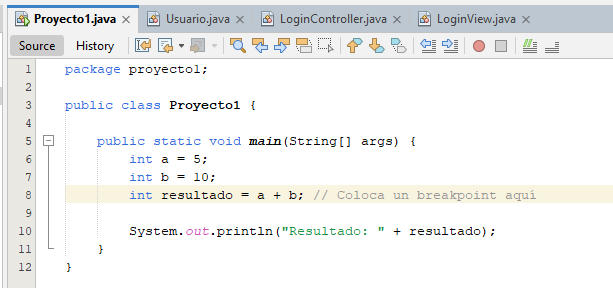
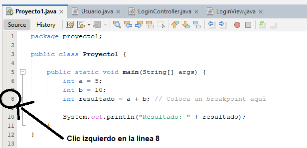
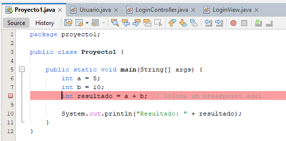
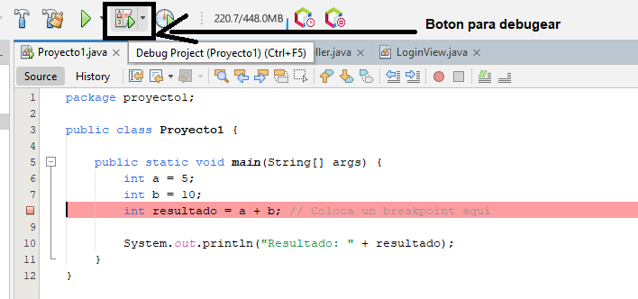

Los breakpoints se colocan en un IDE como IntelliJ IDEA o Eclipse para detener la ejecución del programa en un punto específico.

* **Inline**: Se coloca directamente en la línea donde se ejecuta una operación.
* **Function**: Se coloca en una función para analizar su ejecución.
* **Entrar a función (Step Into)**: Permite entrar a la ejecución de la función.
* **Salir de función (Step Out)**: Permite salir de la ejecución de la función.

Tenemos que dar clic al lado izquierdo de la linea de codigo, para poner un cuadro o circulo rojo, eso significara que se puso el breakpoint, asi como se ve en las imagenes.

Antes:

Accion:

Despues:

Final:

